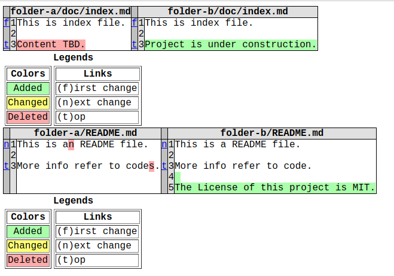

# dompare

[](https://github.com/vra/dompare/actions)

A command line tool to diff two directories recursively.

## Demo

<p align="center">

</p>

Then visit http://localhost:5240/xxx.html, as shown in output above, you will see the detailed difference of these two directories:



## Features

1. Easy to install and use, nice visualization
2. Recursively compare same name files in two directories
3. Optional settings for exclude certain directories
4. Completely based on Python and HTML, no extra tools needed

## Installation

```bash
pip3 install dompare
```

## Using dompare
### Basic usage
```bash
dompare folder-a folder-b
```

Then open your webbrowser and visit `http://localhost:5140`, you will see the difference information of `folder-a` and `folder-b`.

### Public access
You can also use `--host` and `--port` options to change your host and port to listen:

```bash
dompare folder-a folder-b --host 0.0.0.0 --port 8888
```

By adding `--host 0.0.0.0`, you and other people can visit diff file by url `http://your_ip:5140/dompare-xxxxxx.html`.

### Exclude binary folders

You can add `--exclude dir1 dir2` to ignore certain directories (e.g., temporal folders, folders with binary files):

```bash
dompare dir1 dir2 --exclude build out
```

### Verbose mode

If you need more detailed information, use `--verbose` option.

```bash
dompare folder-a folder-b --verbose
[DEBUG] [2019-10-31 15:35:37] [dompare] Processing dir folder-a/doc
[DEBUG] [2019-10-31 15:35:37] [dompare] Compare folder-a/doc/index.md and folder-b/doc/index.md
[DEBUG] [2019-10-31 15:35:37] [dompare] Compare folder-a/README.md and folder-b/README.md
[INFO] [2019-10-31 15:35:37] [dompare] Compare finished. Please visit http://localhost:5140/dompare-paepy47m.html to see diff file (Press Ctrl-C to stop)
[DEBUG] [2019-10-31 15:35:37] [dompare] Run command: cd /tmp && python3 -m http.server --bind localhost 5140
Serving HTTP on 127.0.0.1 port 5140 ...
```

For all options, run `dompare -h`.

```text
dompare -h
usage: dompare [-h] [--host HOST] [--port PORT] [--verbose]
               [--exclude EXCLUDE [EXCLUDE ...]]
               dir1 dir2

positional arguments:
  dir1                  Path to the first directory
  dir2                  Path to the second directory

optional arguments:
  -h, --help            show this help message and exit
  --host HOST           host to bind
  --port PORT           port to listen
  --verbose             Show detailed information
  --exclude EXCLUDE [EXCLUDE ...]
                        Ignore listed directories when diff
```

## TODO

There are some ideas I want to do in the future:

1. [x] Windows support (tested on Windows 8.1, Python 3.7.2)
2. [ ] More pretty UI to show diff, like font size, scroll bar removing  

## Contributing

Any contribution is welcomed. If you find a bug or have any new features, please create an issue or a pull request.

## License

[MIT](LICENSE) © Yunfeng Wang
