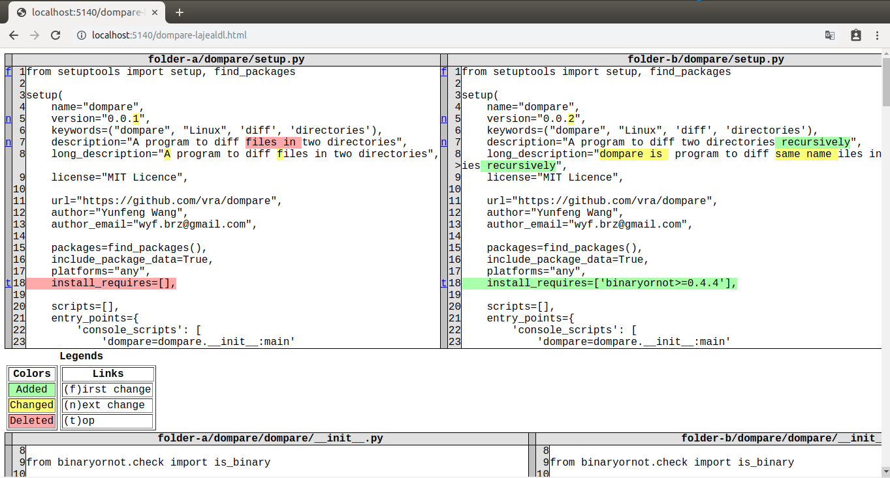

# dompare
A command line tool to diff two directories recursively.

## Demo


Then  visit http://localhost:5140/xxx.html, as shown in output above, you will see the detailed difference of these two directories:




## Features
 1. Easy to use
 2. Recursively compare same name files in two directories.

## Installation
```bash
pip3 install dompare
```

## Using dompare
```bash
dompare folder-a folder-b
```
Then open your webbrowser and visit `http://localhost:5140`, you will see the difference information of `folder-a` and `folder-b`.

You can also use `--host` and `--port` options to change your host and port to listen:
```bash
dompare folder-a folder-b --host 0.0.0.0 --port 8888
```
By Add `--host 0.0.0.0`, you and other people can visit diff file by url `http://your_ip:5140/dompare-xxxxxx.html`.


You can add `--exclude dir1 dir2` to ignore certain directories:
```bash
dompare dir1 dir2 --exclude build out
```

If you need more detailed information, use `--verbose` option.

For all options, run `dompare -h`.
```bash
$ dompare -h
usage: dompare [-h] [--host HOST] [--port PORT] [--verbose]
               [--exclude EXCLUDE [EXCLUDE ...]]
               dir1 dir2

positional arguments:
  dir1                  Path to the first directory
  dir2                  Path to the second directory

optional arguments:
  -h, --help            show this help message and exit
  --host HOST           host to bind
  --port PORT           port to listen
  --verbose             Show detailed information
  --exclude EXCLUDE [EXCLUDE ...]
                        Ignore listed directories when diff
```

## TODO
There are some ideas I want to do in the future:
1. [ ] Windows support
2. [ ] More pretty UI to show diff, like font size, scroll bar removing  

## Contributing
Any contribution is welcomed. If you find a bug or have any new features, please create an issue or a pull request. 

## License
[MIT](LICENSE)
